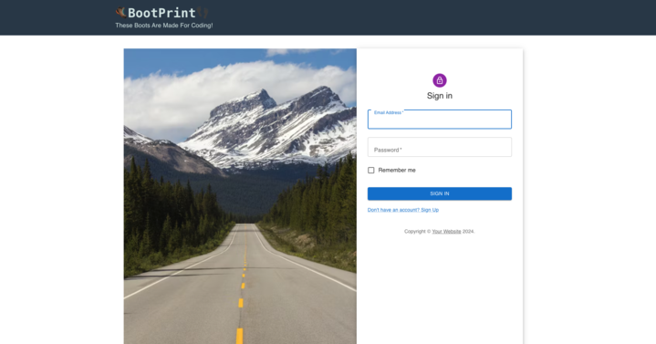
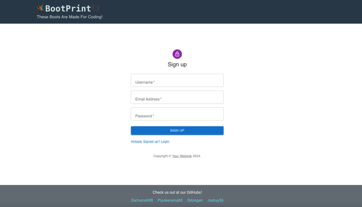
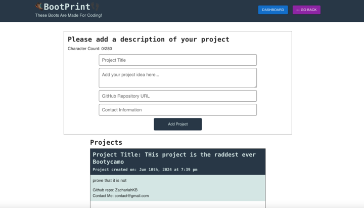
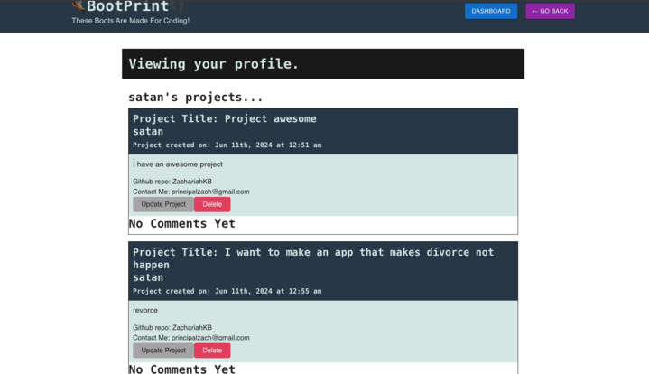
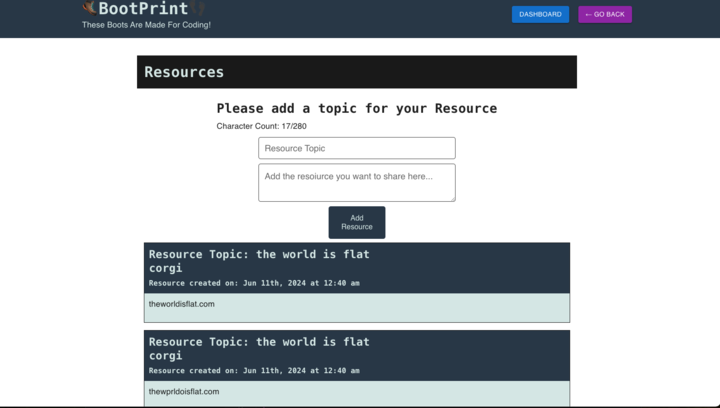

# Bootcamp Alumni Network

## Project Overview

Completing a coding bootcamp can be a daunting and overwhelming experience. This project aims to develop a comprehensive website dedicated to bootcamp alumni and prospective students, providing them with valuable resources, networking opportunities, and support to transition smoothly into their professional careers.

## Table of Contents

- [Features](#features)
- [Project Requirements](#project-requirements)
- [Problem Statement](#problem-statement)
- [Proposed Solution](#proposed-solution)
- [Technologies Used](#technologies-used)
- [Deployment](#deployment)
- [Installation](#installation)
- [Credits](#credits)
- [Important Links](#important-links)
- [Contributing](#contributing)
- [License](#license)

## Features

- **Note Sharing and Learning Strategies:** Alumni can post notes, study guides, and personal strategies that helped them succeed during the bootcamp.
- **Job Opportunities and Networking:** A section for sharing job opportunities, internships, and freelance projects. Alumni can also announce their job placements.
- **Bootcamp Reviews and Tips:** A review section where alumni can provide detailed feedback on their bootcamp experience, including tips on navigating the course.
- **Community Support:** Forums and discussion boards for alumni to stay connected, offer mutual support, and share updates on their career progress.
- **Career Services:** Long-term career support services such as exploring career options, developing professional goals, addressing gaps in work experience, networking best practices, and more.

## Project Requirements

For this project, our group conceived and executed a design that solves a real-world problem. We created a collaborative MERN-stack single-page application that combines a scalable MongoDB back end, a GraphQL API, and an Express.js and Node.js server with a React front end, implementing user authentication with JWT.

### Key Requirements

- **Front End:** Used React with Material UI.
- **Back End:** Used GraphQL with a Node.js and Express.js server, MongoDB with Mongoose ODM.
- **Deployment:** Deployed using Render.

## Problem Statement

Completing a coding bootcamp can be an overwhelming experience for many students due to the intense pace and dense learning materials. Graduates often feel isolated and uncertain about their next steps despite acquiring valuable skills. Additionally, prospective students lack a centralized platform to access firsthand reviews and tips from previous students.

## Proposed Solution

To address these challenges, we propose the development of a comprehensive website dedicated to bootcamp alumni and prospective students. This platform will offer:

- **Note Sharing and Learning Strategies:** Alumni can post their notes, study guides, and personal strategies.
- **Job Opportunities and Networking:** A dedicated section for sharing job opportunities, internships, and freelance projects. Alumni can also announce their job placements.
- **Bootcamp Reviews and Tips:** A review section for detailed feedback on the bootcamp experience, including navigation tips, time management, and resource leverage.
- **Community Support:** Forums and discussion boards for alumni to stay connected, offer support, and share career progress updates.

This platform aims to foster a supportive community that helps bootcamp graduates transition smoothly into their professional careers while providing invaluable insights to new and upcoming students.

### Career Services Offered Long-Term

- Exploring career options
- Developing professional goals
- Researching industries of interest
- Navigating a career pivot
- Addressing gaps in work experience
- Organizing your job search
- Networking best practices
- Interviewing strategies
- Conducting mock interviews
- Negotiating offers or salaries
- And more!

## Technologies Used

- React
- Material UI
- GraphQL
- Node.js
- Express.js
- MongoDB
- Mongoose
- JWT Authentication

## Deployment

The project is deployed on Render. Here are the deployment guides:

- [Render Deployment Guide](https://coding-boot-camp.github.io/full-stack/render/deploy-mern-stack-with-render-guide)
- [MongoDB Atlas Setup Guide](https://coding-boot-camp.github.io/full-stack/mongodb/how-to-set-up-mongodb-atlas)

## Installation

To install and run this project locally, follow these steps:

1. Install dependencies:
   ```sh
   npm install

   npm rundev 


## Credits:

Special Thanks to Drew and Kyle

We just wanted to reach out and say a massive thank you for everything you've done during this arduous endeavor. Seriously, your guidance and support have been incredible. You guys have really helped us wrap our heads around all the coding stuff with such clarity and confidence. Breaking down those complex concepts into simpler parts was such a game-changer.

But it's not just about the technical skills, you've given us that problem-solving mindset that's so important in this field. Your mentorship has set us up with the tools and knowledge to succeed and kill it in our careers in software development.

We really appreciate all the time and effort you've put into teaching us. Your lessons have made a huge impact on us, and we'll carry those with us for sure.

Thanks a ton, Drew and Kyle, for being such awesome teachers and mentors. You guys are the best!

Cheers,

The FAFO Crew

- Edwin : https://github.com/gitongah 

- Paulee : https://github.com/Pauleerama93 

- Zachariah : https://github.com/ZachariahKB 

- Joshy : https://github.com/Joshyy55 

## Screenshots

 - Login Page

- Sign Up Page

- Home Page

- Profile Page

- Resource Page


## Important Links

**Deployed Link:** 

https://project-3-il5t.onrender.com


Our deployed link


**Google Slides for the Presentations:** 

https://docs.google.com/presentation/d/1jHh0IhLFyI_mlxy2AQZLaW9JhrBRuPj0kQUTb1ajyts/edit?usp=sharing


Our google slide for the presentation


**Google Doc:** 

https://docs.google.com/document/d/1182HKgOiFMfcxkHmqVH91QjO86UqTt6in8IhWipPJYk/edit?usp=sharing


A google doc that holds our ideas for the project, tasjk deligations, and scheduling.


**Figma Wireframe** 

https://www.figma.com/board/Dx4OUDQE9IsIHRmOpNZtCs/Untitled?node-id=0-1&t=p9iMvsyep8Ipp7zJ-1


A figma wireframe of our project!

## Contributing 

Contributions are welcome! If you have any ideas for improvements or new features, feel free to open an issue or submit a pull request!

## License

 This project is licensed under the MIT License - see the LICENSE file for details.

Copyright (c) [2024] [The FAFO Crew]

Permission is hereby granted, free of charge, to any person obtaining a copy of this software and associated documentation files (the "Software"), to deal in the Software without restriction, including without limitation the rights to use, copy, modify, merge, publish, distribute, sublicense, and/or sell copies of the Software, and to permit persons to whom the Software is furnished to do so, subject to the following conditions:

The above copyright notice and this permission notice shall be included in all copies or substantial portions of the Software.

THE SOFTWARE IS PROVIDED "AS IS", WITHOUT WARRANTY OF ANY KIND, EXPRESS OR IMPLIED, INCLUDING BUT NOT LIMITED TO THE WARRANTIES OF MERCHANTABILITY, FITNESS FOR A PARTICULAR PURPOSE AND NONINFRINGEMENT. IN NO EVENT SHALL THE AUTHORS OR COPYRIGHT HOLDERS BE LIABLE FOR ANY CLAIM, DAMAGES OR OTHER LIABILITY, WHETHER IN AN ACTION OF CONTRACT, TORT OR OTHERWISE, ARISING FROM, OUT OF OR IN CONNECTION WITH THE SOFTWARE OR THE USE OR OTHER DEALINGS IN THE SOFTWARE.